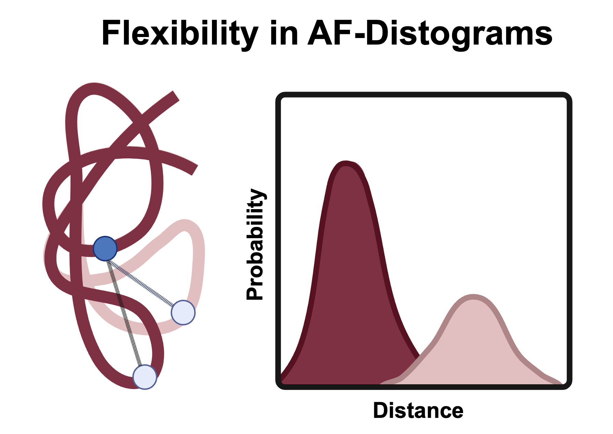

Here we explore **flexibility signals** embedded in **AlphaFold distograms**, with a special focus on **cryo-EM** interpretation.  

This repository supports the manuscript:
**"Exploring the Potential of AlphaFold Distograms for Flexibility Assignment in Cryo-EM Structures"**  
Authors: Büşra Savaş, Ayşe Berçin Barlas, Ezgi Karaca  
[Publication link – coming soon]

---

## 🔬 Research Background

AlphaFold’s distograms encode inter-residue distance distributions that often contain conformational information not visible in final coordinate predictions. In this project, we investigate how these distograms capture hinge-driven conformational flexibility using the AK2:AIFM1 complex as a test case. We compare distogram outputs across AlphaFold versions (AF2, AF2.3, AF3), different sampling strategies (MinnieFold, AF_cluster, and AFsample2), and assess their correspondence with molecular dynamics simulations.

---

## 📂 Folder Structure
```
data/
├── distograms/              # Generated distograms per tool and target
├── pdbs/                    # Structural predictions and calculated distance measurements
├── msas/                    # MSA files (.a3m) used in distogram generation
├── md/                      # Molecular dynamics based reference distances

scripts/
├── dist-calc-two-res.py     # For extracting pairwise distance over PDB files
└── distogram-figures.ipynb  # Plotting scripts for the figures in the manuscript
```
**Visualize hinge motion distograms**

Use the provided Jupyter notebook to reproduce key figures in the manuscript, such as distogram plotting:
```
plot_all_distograms_in_directory(
    "/path/to/distograms",
    res_i=res_i,
    res_j=res_j,
    title=f"AK2 Distogram: Residue {res_i} vs {res_j}"
)
```
**Analyze custom pairwise distances**

Extract pairwise distance distributions for any residue pair (e.g., 230–233):
```
python dist-calc-two-res.py --input_pdb /path/to/pdb --residue1 230 --residue2 233
```

**🧠 Citing This Work**

If you find this repository useful, please consider citing our paper.

**📧 Contact**

For questions or contributions, feel free to contact:

Ezgi Karaca
📩 ezgi.karaca@ibg.edu.tr
