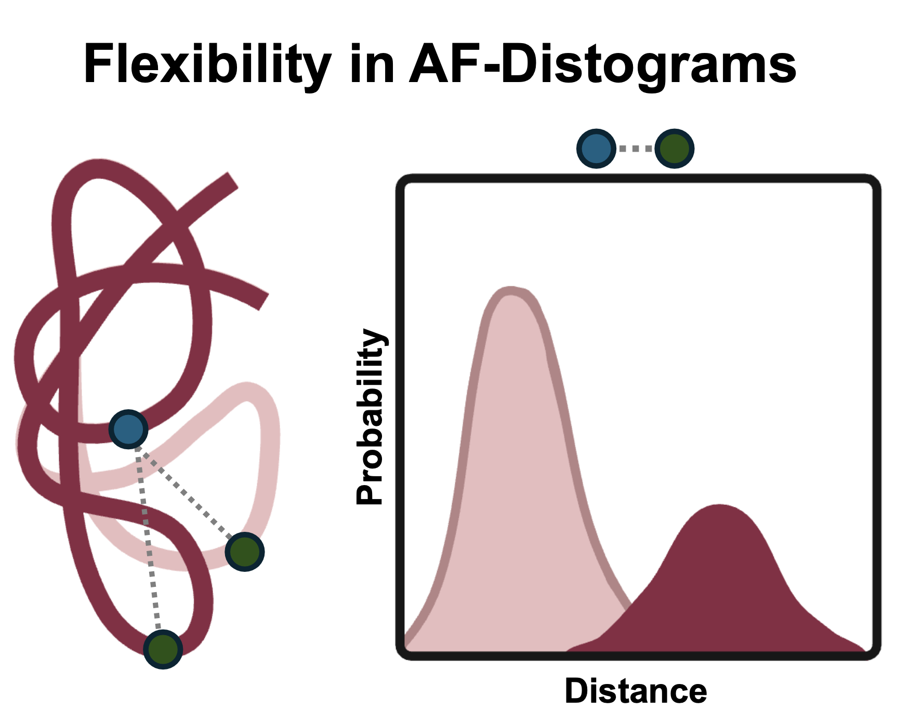

Here we explore **flexibility signals** embedded in **AlphaFold distograms**, with a special focus on **predicting binding-induced hinge motion** interpretation.  

This repository supports the manuscript:
[**"Exploring the Potential of AlphaFold Distograms for Predicting Binding-induced Hinge Motions"**](https://www.biorxiv.org/content/10.1101/2025.07.25.666757v3)  
Authors: Büşra Savaş, Ayşe Berçin Barlas, Ezgi Karaca  

---

## 🔬 Research Background

AlphaFold’s distograms encode inter-residue distance distributions that often contain conformational information not visible in the final coordinate predictions. In this project, we investigate how these distograms capture binding-induced hinge motions using the AK2:AIFM1 complex as a test case. We compare distogram outputs across multiple AlphaFold versions (AF2.0 (AF2-ptm), AF2.1, AF2.2, AF2.3, AF3), different enhanced sampling strategies (MinnieFold, AF_cluster, AFsample2, AF3sample2, AF3_cluster), and evaluate their correspondence with molecular dynamics simulations. We also compare structural outputs from AF2- and AF3-based enhanced sampling methods with generative approaches such as BioEmu, Chai-1, and Boltz-2 in terms of sampled hinge distances.

---

## 📂 Folder Structure
```
data*/                                        
├── distograms**/                               # Generated pairwise distograms for our case set, including AK2, IL1R1, MIA40, and EIF2B3.
├── pdb-distances**/                            # Calculated pairwise distance measurements for our case set.
├── msas/                                     # MSA files (.a3m) used in distogram generation
├── md/                                       # Molecular dynamics based reference distances

scripts/
├── dist-calc-two-res.py                      # Extracts pairwise distances from PDB files
├── extract_distogram_pair.py                 # Extracts pairwise distograms from .pkl, .pickle or .npz files
└── column_masking.py                         # Generates perturbed MSAs from AFsample2 .pkl outputs and the original MSA
```
\* PDB files omitted from the repo; available via [Zenodo.](https://zenodo.org/records/16364512)
\** Each csv file comes with a corresponding txt file providing a description of the run parameters for each data.
  
**Calculate custom pairwise distances**

Extract pairwise distance distributions for any residue pair (e.g., 230–233):
```
python dist-calc-two-res.py --input_pdb /path/to/pdb --residue1 230 --residue2 233
```

**Retrieve custom pairwise distograms**
Extract pairwise distograms for any residue pair (e.g., 230–233), and supports .npz, .pickle, and .pkl file formats.
```
python extract_distogram_pair.py --input_pickle /path/to/pickle 230 233
```

**Generate Perturbed MSAs for AF3sample2 pipeline**

Create perturbed MSAs using AFsample2 output pickle files:
```
python column_masking.py --msa_file path/to/input.msa.a3m --pkl_file path/to/afsample2_output.pkl
```

**🧠 Citing This Work**

If you find this repository useful, please consider citing our paper.

**📧 Contact**

For questions or contributions, feel free to contact:

Ezgi Karaca
📩 ezgi.karaca@ibg.edu.tr
